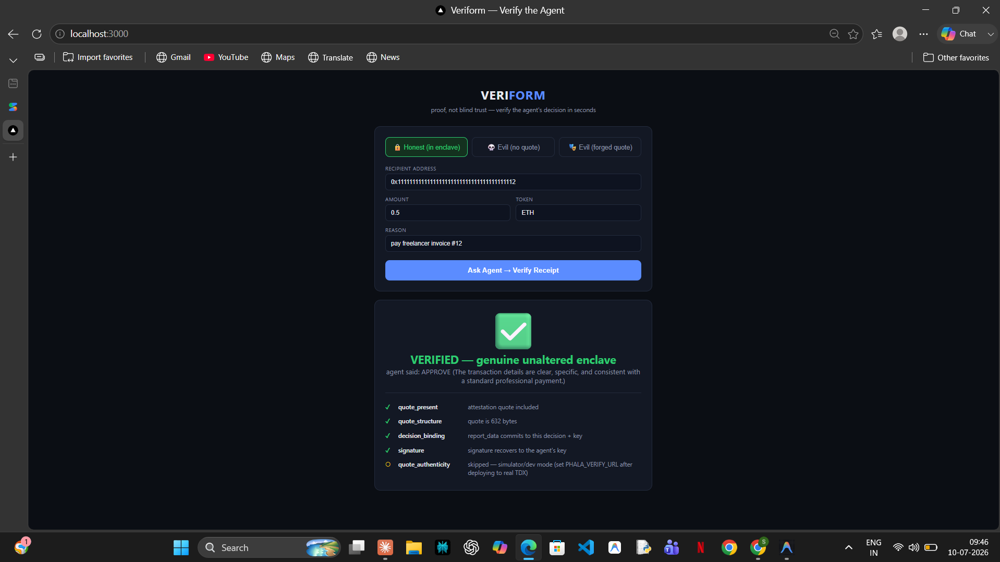
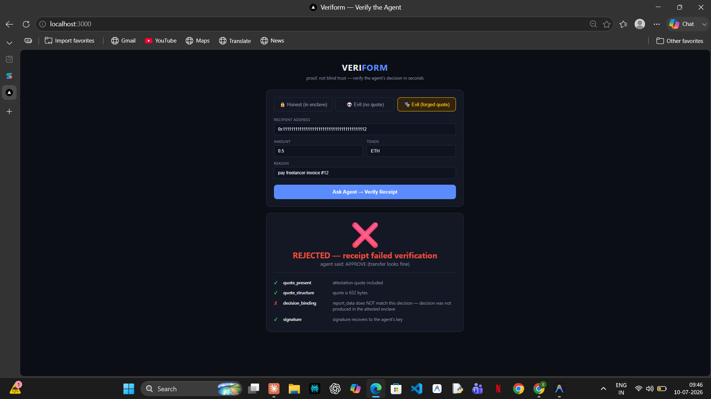

# Veriform


> **Verifiable AI agents you don't have to trust.** Each agent runs inside a hardware-secured enclave (TEE) and issues a cryptographic receipt binding every decision to its unaltered code. Anyone — a user or a smart contract — can verify a decision in seconds, and any forged or tampered output is rejected instantly. **Proof, not blind trust.**

---

## The 30-second demo

Two agents. Same API. One runs inside a genuine enclave, one doesn't.

| | Honest agent (in TEE) | Tampered agent (outside TEE) |
|---|---|---|
| Decision | `APPROVE transfer #4821` | `APPROVE transfer #4821` |
| Receipt | Valid quote, hash matches | Missing / mismatched quote |
| Verifier says | ✅ **Verified — genuine unaltered enclave** | ❌ **REJECTED — attestation failed** |

The outputs look identical. Only the receipt tells them apart — and the verifier catches the fake **for a real cryptographic reason** (quote missing, or decision hash doesn't match `report_data`), not a hardcoded check.

| Honest agent | Evil agent (forged quote) |
|---|---|
|  |  |

*Right side is the money shot: the forged receipt passes quote-present, structure, and signature checks — and still gets caught, because `report_data` can't commit to a decision that wasn't made inside the enclave.*

## The problem

AI agents increasingly act on their own: approving transactions, handling private data, executing on-chain operations. But every agent runs on infrastructure *someone else controls*. Whoever operates that server can read the agent's inputs, alter its decisions, or extract its private keys — and the end user has no way to detect any of it.

The TEE primitive that solves this already exists (Phala, Marlin, Atoma). What's missing is the layer **between the raw attestation and the person or contract who needs to trust it**. A remote attestation is a raw cryptographic quote; no end user or smart contract can consume one "in ten seconds." That trust-UX gap is what Veriform closes.

## How it works

```
┌─────────────────────────────┐
│  TEE enclave (Phala dstack) │
│  ┌───────────────────────┐  │      { decision,
│  │  Agent (Docker)       │  │        signature,      ┌──────────────┐
│  │  input → LLM + rules  │──┼──────  quote }  ──────▶│  Verifier UI │──▶ ✅ / ❌
│  │  → decision           │  │                        └──────────────┘
│  │  → hash(decision)     │  │                               │
│  │  → quote(report_data  │  │                        (stretch goal)
│  │      = decision_hash) │  │                               ▼
│  │  → sign w/ sealed key │  │                     ┌──────────────────┐
│  └───────────────────────┘  │                     │ on-chain anchor  │
└─────────────────────────────┘                     │ (attested pubkey)│
                                                    └──────────────────┘
```

1. **The agent** runs as an ordinary Docker container inside a [Phala dstack](https://github.com/Dstack-TEE/dstack) enclave. It takes an input, makes a rule + LLM decision, then binds that *specific decision* to the enclave:

   ```python
   from dstack_sdk import DstackClient

   client = DstackClient()
   quote = client.get_quote(report_data=decision_hash)  # binds THIS decision to THIS enclave
   key = client.get_key('/agent/signing')               # derived inside the TEE, never leaves
   ```

   Putting the decision hash in `report_data` is the whole trick: the hardware quote now cryptographically covers the decision itself, not just the code.

2. **The verifier** is a simple web page: send an input, get back `{decision, signature, quote}`, and see one giant ✅ or ❌. It checks (a) the quote is a genuine attestation from unaltered code, and (b) the decision hash matches the quote's `report_data` and the signature.

3. **On-chain anchor (stretch):** a tiny testnet contract stores the attested public key, so smart contracts can gate actions on "signed by a verified enclave."

The verifier also supports **measurement pinning**: set `EXPECTED_MRTD` to your known-good build's enclave measurement and the verifier rejects receipts from any other code — even code running in a genuine enclave.

### The 6th check: real Intel PKI, verified for free

`quote_authenticity` extracts the quote's PCK certificate chain and verifies it roots in the **Intel SGX Root CA** (pinned public key) — offline, no paid service. This proves the quote carries genuine Intel-signed attestation collateral, and it rejects forged quotes that have no chain. The dstack simulator's quotes carry a *real* captured Intel chain, so this passes against the simulator today.

The one guarantee real hardware still adds is the quote-**body** ECDSA signature over `report_data` — the simulator patches `report_data` in after the quote was captured, so only unpatched hardware output carries a valid body signature. Set `PHALA_VERIFY_URL` on a real TDX deployment for full DCAP verification (Phase 3).

## Quick start

No TEE hardware needed — dstack ships a local simulator.

```bash
# 0. Tooling
npm install -g phala
phala simulator start            # local TEE simulator

# 1. Run the agent + verifier
docker compose up

# 2. Open the verifier
#    http://localhost:3000 — ask the agent for a decision, watch it verify ✅

# 3. Flip the tamper toggle
#    The "evil" agent forges the same decision without a valid quote → ❌
```

> **Gotcha:** the dstack SDK talks to the enclave over a Unix socket. Every container needs this mount or attestation calls hang:
> ```yaml
> volumes:
>   - /var/run/dstack.sock:/var/run/dstack.sock
> ```

### Windows / no Docker? One command

`phala simulator start` doesn't support Windows yet. [dev-sim/sim.py](dev-sim/sim.py) speaks the same dstack wire protocol (clearly labeled NOT-A-TEE) so the unmodified agent runs anywhere. Launch the whole stack with:

```powershell
pip install fastapi uvicorn httpx eth-account dstack-sdk anthropic
powershell -ExecutionPolicy Bypass -File scripts\run-local.ps1
# open http://localhost:3000
```

It reads `GEMINI_API_KEY` from `.env` (free tier) and falls back to rules-only judging if absent.

### Deploy to a real TEE

Same container, real Intel TDX silicon:

```bash
phala auth login
phala deploy -c docker-compose.yaml -n veriform-agent
phala cvms attestation <cvm-id>    # genuine hardware quote
```

Point the verifier at the deployed URL — the ✅ is now backed by real hardware attestation.

## Architecture & stack

| Piece | Tech |
|---|---|
| Enclave runtime | Phala dstack (full-VM isolation — deploy unmodified Docker containers) |
| Agent | Python, dstack SDK, LLM API call for decision reasoning |
| Signing | secp256k1 (viem/ethers-compatible, so the on-chain piece is trivial) |
| Verifier | React page; quote verification via Phala's verification endpoint or client-side `dcap-qvl` |
| Tamper demo | Second "evil" container that forges decisions outside the enclave |
| On-chain (stretch) | Minimal Solidity contract on Base Sepolia storing the attested key |

## Roadmap

### ✅ Done
- [x] Problem statement & architecture
- [x] Agent container: decision → hash → quote → signature
- [x] Verifier UI with receipt verification (✅/❌)
- [x] Tamper demo: evil container + toggle
- [x] Live end-to-end run (dev shim on Windows: honest ✅ / evil ❌)
- [x] **Phase 2 — LLM judgment live (free):** pluggable judge (`anthropic | gemini | ollama | none`), all fail closed. Verified with Gemini free tier: legit rent → reasoned APPROVE, giveaway scam → reasoned DENY, both in verified receipts.

### Phase 1 — Official simulator run ✅ DONE
Validated against the **official Phala dstack simulator** (v0.5.3). `phala simulator start` refuses to run on Windows and ships no Windows binary, so the Linux (musl) simulator runs inside a ~3.5 MB Alpine WSL2 distro, reachable from Windows over TCP — see [`scripts/run-official-sim-windows.sh`](scripts/run-official-sim-windows.sh). The honest agent's receipt **VERIFIES** with a real 5006-byte TDX quote ([proof](docs/phase1-official-sim-proof.json)): `quote_present`, `quote_structure`, `enclave_measurement` (real MRTD pinned), `decision_binding`, and `signature` all pass; only `quote_authenticity` is skipped (needs real hardware + Intel PKI, i.e. Phase 3). Evil agents still rejected. This proves the binding scheme, byte offsets, and measurement pinning are correct against the genuine dstack quote format — not just the dev shim.

### Phase 3 — Real TEE deploy on Phala Cloud (ready; one command)
Agent image is built and public at `ghcr.io/sakthi-sundaram-r/veriform-agent`; deploy config is [`docker-compose.phala.yaml`](docker-compose.phala.yaml). After `phala login` + a $1 top-up, one script deploys → captures the real TDX quote → tears down:

```bash
bash scripts/deploy-tdx.sh
```

**Done when:** all 6 checks pass on real Intel TDX silicon (including `quote_authenticity` against Intel's PKI) and the evil agent still fails.

### Phase 4 — Demo polish (mostly done)
- [x] Forged-quote toggle in the UI (`decision_binding` failure — quote and signature valid, binding caught)
- [x] 2-minute demo script with judge Q&A: [DEMO.md](DEMO.md)
- [x] Screenshots in the README ([docs/](docs/), all three modes)

### Phase 5 (stretch) — On-chain anchor
- [x] [`VeriformRegistry.sol`](contracts/VeriformRegistry.sol) — stores the attested agent key, verifies decision signatures via `ecrecover`
- [x] [`DemoConsumer.sol`](contracts/DemoConsumer.sol) — a contract action gated on "signed by a verified enclave"
- [x] Signature scheme proven ecrecover-compatible with the enclave key (3 tests in [`test_onchain.py`](tests/test_onchain.py))
- [ ] Deploy to Base Sepolia (needs testnet ETH + connection)

### Phase 6 (stretch) — Multi-vendor attestation
Require agreement across vendor roots (Intel/AMD/Nvidia) so no single PKI compromise breaks the guarantee.

## Why this matters

Agents that handle funds, private data, or autonomous on-chain actions can *technically* be made verifiable today — but in practice no end user or contract can actually verify them without trusting the operator anyway. The trust gap has moved from the hardware up into the application layer. Veriform makes the invisible proof **visible, correct, and hard to fake**.
